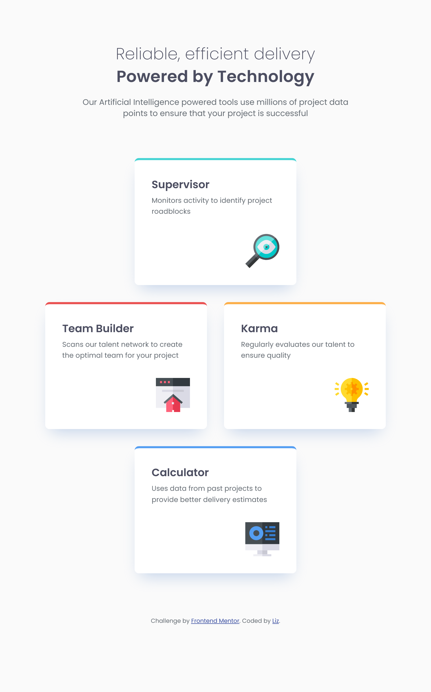
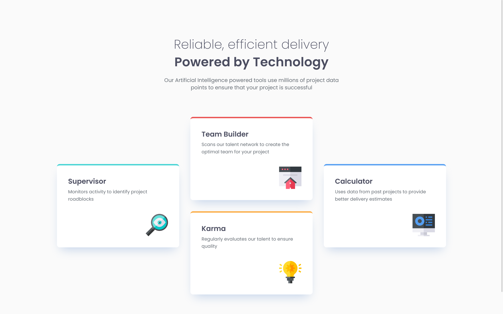

# four-card-feature-section

# Frontend Mentor - Four card feature section solution

This is a solution to the [Four card feature section challenge on Frontend Mentor](https://www.frontendmentor.io/challenges/four-card-feature-section-weK1eFYK). Frontend Mentor challenges help you improve your coding skills by building realistic projects.

## Table of contents

- [Overview](#overview)
  - [The challenge](#the-challenge)
  - [Screenshot](#screenshot)
  - [Links](#links)
- [My process](#my-process)
  - [Built with](#built-with)
  - [What I learned](#what-i-learned)
  - [Continued development](#continued-development)
  - [Useful resources](#useful-resources)

## Overview

### The challenge

Users should be able to:

- View the optimal layout for the site depending on their device's screen size

### Screenshot





### Links

- Solution URL: [Add solution URL here](https://your-solution-url.com)
- Live Site URL: [Add live site URL here](https://your-live-site-url.com)

## My process

### Built with

- Semantic HTML5 markup
- CSS custom properties
- CSS Grid
- Mobile-first workflow

### What I learned

On this project of creating four card feature section, I learned to use grid-template-areas to create a responsive layout. This CSS property allowed me to define named grid areas and easily position the cards while maintaining a column layout on mobile devices. By assigning names to grid items using the grid-area property and then referencing those names in grid-template-areas, I was able to create a complex layout without relying on line numbers. This approach made it simpler to visualize and manage the overall structure of the four-card feature section, especially when implementing responsive design.

To see how you can add code snippets, see below:

```css tablet design
@media (min-width: 600px) {
  .feature {
    gap: 74px;
    padding-block: 80px;
  }

  .feature__card-wrapper {
    max-width: 640px;
  }

  .feature__layout-grid {
    display: grid;
    grid-template-columns: repeat(4, 1fr);
    grid-template-areas:
      '. one one .'
      'two two three three'
      '. four four .';
    gap: 32px;
    justify-items: center;
  }

  .feature__layout-grid > :nth-child(1) {
    grid-area: one;
  }

  .feature__layout-grid > :nth-child(2) {
    grid-area: two;
  }

  .feature__layout-grid > :nth-child(3) {
    grid-area: three;
  }

  .feature__layout-grid > :nth-child(4) {
    grid-area: four;
  }
}
```

```css desktop
@media (min-width: 900px) {
  .feature {
    gap: 74px;
    padding-block: 102px;
  }

  .feature__card-wrapper {
    max-width: 1114px;
  }

  .feature__layout-grid {
    display: grid;
    grid-template-columns: repeat(3, 1fr);
    grid-template-areas:
      '. two .'
      'one two four'
      'one three four'
      '. three .';
    gap: 32px;
  }

  .feature__layout-grid > :nth-child(1) {
    grid-area: one;
  }

  .feature__layout-grid > :nth-child(2) {
    grid-area: two;
  }

  .feature__layout-grid > :nth-child(3) {
    grid-area: three;
  }

  .feature__layout-grid > :nth-child(4) {
    grid-area: four;
  }
}
```

### Continued development

I want learn more about CSS grid tactics when implementing responsive design.

### Useful resources

- [Example resource 1](https://developer.mozilla.org/en-US/docs/Web/CSS/grid-template-areas)

## Author

- Website - [Add your name here](https://www.your-site.com)
- Frontend Mentor - [@yourusername](https://www.frontendmentor.io/profile/Coder-Liz)
